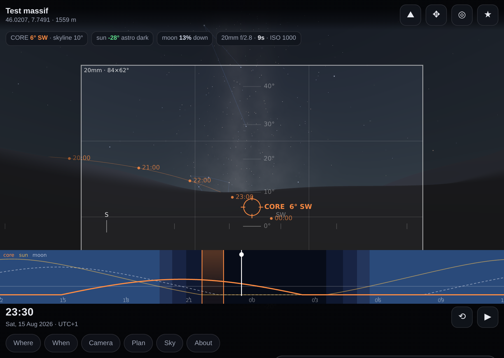

# AstroScout

Stand anywhere on Earth, at any hour of any night, and see what the camera will
see: real terrain at 1:1 scale under an astronomically accurate sky.

It answers the question you actually have when planning a Milky Way shot — *on
which night, at what time, does the core sit over that ridge, with no moon and
proper darkness* — and then shows you the frame.



---

## What it does

- **Real terrain.** Streams open elevation tiles and builds a mesh centred on
  your eye — dense underfoot, coarse toward the horizon, out to 160 km. Earth
  curvature and standard atmospheric refraction are baked in, so a peak 60 km
  away sits at the altitude it really appears at. Optional satellite imagery
  drapes over it so you recognise the place.
- **Accurate sky.** Sun and Moon from Meeus (agreeing with the published
  reference cases to well under an arcsecond), planets from the JPL Keplerian
  approximations, stars precessed from J2000 to your date, and a Milky Way drawn
  from exact galactic coordinates.
- **Night timeline.** Twilight bands, sun/moon/core altitude curves and the
  shootable window shaded in. Drag to scrub; the view follows.
- **Best-window finder.** Scans 30/60/120 nights and ranks them on darkness,
  moon, core altitude and — if you point the view at your foreground — whether
  the core is actually over it. It uses the *terrain* skyline, not the
  mathematical horizon, so a night where the core never clears the ridge is
  correctly rejected.
- **Camera framing.** Pick sensor and focal length and the view is that lens,
  with the frame drawn inside a wider context view. NPF shutter limit, 500-rule
  comparison, suggested ISO, frames needed for a stack.
- **Map and terrain explorer.** Opens in a top-down 2D satellite map, with a
  one-tap toggle into fully relief-shaded 3D terrain. The
  core's bearing is drawn along the ground from where you stand, so you can see
  which ridge it will sit over. Tap anywhere to read that point's elevation and
  distance, then **View POV** to move — the mesh rebuilds in about 80 ms from
  tiles already in hand, and the planner's windows recompute against the new
  skyline. Drag pans the 2D map; in 3D it orbits; pinch zooms in either view.
- **Field ready.** Installs to the home screen, works offline on cached tiles,
  and follows the device compass so you can hold the tablet up at the spot.

---

## Running it

### GitHub Pages from a phone (no terminal)

`deploy/` is the same app as six flat files — no subdirectories — so it can be
multi-selected in a file picker and uploaded straight through GitHub's web UI:

1. github.com → **+** → **New repository** → name it, **Public**, create it with
   no README and no .gitignore.
2. On the empty repo page tap **uploading an existing file**, choose all six
   files from `deploy/`, and commit.
3. **Settings → Pages → Deploy from a branch → main / (root)**.

Live a minute later, with HTTPS, the service worker, GPS and the compass all
working. `index.html` there is the whole app inlined; the other five files are
the icons, manifest and service worker that make it installable.

### GitHub Pages from a machine with git (recommended)

```bash
git init && git add -A && git commit -m "AstroScout"
git branch -M main
git remote add origin git@github.com:<you>/astroscout.git
git push -u origin main
```

Then **Settings → Pages → Source: Deploy from a branch → main / (root)**.
It is live at `https://<you>.github.io/astroscout/` within a minute or two.

Nothing needs building — the repo is the site. `.nojekyll` stops GitHub from
touching the files.

Serving over HTTPS matters: the service worker, geolocation and the device
compass are all HTTPS-only. GitHub Pages gives you that for free.

### Installing on a phone or tablet

- **Android / Chrome:** open the Pages URL → ⋮ → *Add to home screen*.
- **iPad / iPhone / Safari:** open the URL → Share → *Add to Home Screen*.

It then launches fullscreen with no browser chrome. A wrapper app (TWA,
Capacitor) buys you nothing except Play Store listing; the same URL wraps later
if you ever want that.

### Locally, no server

Open `dist/astroscout.html`. It is the whole app inlined into one file — no
modules, no CDN, nothing to install. Double-click it.

### Locally, with a server (for hacking on the source)

```bash
python3 -m http.server 8080
# then open http://localhost:8080/
```

The unbundled source uses ES modules, which browsers refuse to load over
`file://` — hence the server, or use the single-file build above.

Rebuild the single-file version after editing:

```bash
python3 build.py
```

---

## Using it in the field

1. At home, on wifi: pick the spot (search, coordinates, GPS or a preset), hit
   **Load terrain**, and turn on satellite imagery if you want to recognise the
   ground. Tiles land in IndexedDB *and* the service worker cache.
2. **Plan → Use where I'm looking** to lock the foreground direction, then scan
   60 nights. Tap a night to jump the view to the core's peak in that window.
3. At the location, with no signal: the app opens, the terrain is still there,
   and ◎ slews the view to wherever you point the device.

The Where panel shows how much is cached and can clear it.

---

## Accuracy

Verified by the test suite (`node test/*.test.mjs`):

| Quantity | Reference | Agreement |
|---|---|---|
| Apparent sidereal time | Meeus 12.a | 2 × 10⁻⁵ ° |
| Solar RA/Dec | Meeus 25.b | 5 × 10⁻⁶ ° |
| Lunar longitude/latitude | Meeus 47.a | 4 × 10⁻⁷ ° |
| Lunar distance | Meeus 47.a | 15 m |
| Illuminated fraction | Meeus 48.a | 7 × 10⁻⁵ |
| Planet positions | Meeus solar position, via the Kepler pipeline | 0.003 ° |
| Star coordinates | 15 published angular separations | < 0.15 ° |
| General precession | 1.3970 °/century | 3 × 10⁻⁴ ° |

Sanity checks that matter for planning: the core transits due south at
altitude 90 − φ − 29°; Suffolk correctly reports *no astronomical darkness*
around midsummer; the core passes within 4° of the zenith from Uluru.

**Modelled rather than measured:** the Milky Way's brightness structure is a
physical model — Sagittarius bulge, disk thinning toward the anticentre, the
Great Rift, the Cygnus and Scutum clouds — rather than a photographic plate. Its
*position* is exact; its texture is representative. Filler stars below magnitude
5 are procedural and cosmetic; every named star is real. Sky brightness, haze
and light pollution are visual approximations for judging a composition, not
photometry.

---

## Layout

```
index.html              app shell
sw.js                   offline shell + tile cache
manifest.webmanifest    home-screen install
css/app.css
js/astro.js             time, precession, sun, moon, planets, rise/set   (no DOM)
js/catalog.js           bright stars, figures, colour, catalogue upgrade (no DOM)
js/terrain.js           tiles, DEM pyramid, mesh, imagery, IndexedDB     (no DOM)
js/planner.js           night sampling, windows, ranking, exposure       (no DOM)
js/render.js            WebGL2 renderer, five passes, zero dependencies
js/ui.js                panels, timeline, heads-up overlay
js/app.js               state, loop, input, glue
js/presets.js           locations, sky-quality presets, lens list
build.py                single-file bundler
test/                   node test suites + a headless-browser render test
dist/astroscout.html    single-file build, opens straight off disk
deploy/                 flat six-file bundle for uploading to a static host
```

The four `no DOM` modules run under Node, which is why they can be tested
directly rather than through the browser.

### Rendering notes

From the eye, the terrain is a height field sampled radially from the camera, so
drawing it outward-in is exactly correct with **no depth buffer at all** — which
sidesteps the depth-precision problem you would otherwise have with a 2 m near
plane and a 160 km far plane. Draw order is sky → stars → lines →
sun/moon/planets → terrain, all with depth testing off.

From the air that ordering no longer holds, so the scout view turns depth
testing on and moves the near plane out in proportion to camera height, which
keeps precision comfortable. It is the only mode that pays for a depth buffer.

Satellite imagery is draped as two levels — a wide coarse composite for context
and a sharp inner one for the foreground — reprojected per-fragment into
web-mercator tile space, since a linear latitude mapping visibly misregisters
across tens of kilometres. One level either blurs the near ground or costs
hundreds of tiles.

Stars live in a static J2000 vertex buffer and are rotated into view by a single
`mat3` uniform that composes precession with the Earth's rotation, so scrubbing
time costs nothing.

---

## Data sources

| Layer | Default | Key needed |
|---|---|---|
| Elevation | AWS Terrain Tiles (Terrarium) | no |
| Elevation (alt) | Mapbox / MapTiler Terrain-RGB | yes, paste in Sky panel |
| Imagery | Esri World Imagery, OpenStreetMap, Esri Topo | no |
| Place search | Nominatim (OpenStreetMap) | no |
| Star catalogue (optional upgrade) | d3-celestial data on jsDelivr, ~9 000 stars | no |

If the default elevation host is ever unavailable, switch source or add a key in
**Sky & terrain → Data sources**. The app degrades to sky-only rather than
failing.

Please respect the usage policies of the free tile services — heavy use should
move to a keyed provider.

---

## Ideas worth adding

- Import a GPX track and scout every waypoint along it.
- Pan the scout view's look-at point, rather than only orbiting the origin.
- Shadow casting from the terrain for moonlit foregrounds.
- Panorama export: sweep the azimuth and stitch, for a printable planning sheet.
- Stack-time calculator that accounts for field rotation.
- Save a composition (place + time + lens + azimuth) as a shareable URL.

---

## Credits

Algorithms: Jean Meeus, *Astronomical Algorithms* (2nd ed.); JPL/Standish
approximate planetary elements. Star positions from the Bright Star Catalogue.
Elevation tiles from AWS Terrain Tiles (Mapzen). Imagery from Esri and
OpenStreetMap contributors.
